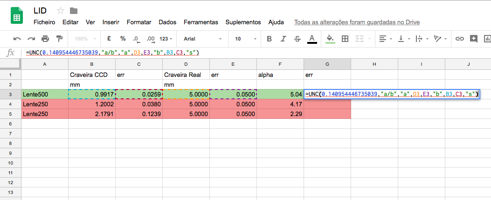

# gsErrorPropagator
This is an uncertainty calculator add-on for Google Spreadsheets which allows the user to retrieve the number value, standard deviation and maximum error (error propagation with the sum of partial derivatives associated with each variable times the error associated with that variable) associated with measurements that follow a known model. Unleash the power of uncertainties in Google Spreadsheets.

## Instalation
1. First, you will need to install python3 and pip3 in your OS according to the Python documentation that you can find in the official website.
2. Now you must install some packages. Let's start with the "oauth2client" one. Just open your terminal, type and run the following line:
```
pip3 install oauth2client
```
3. After that, type and run:
```
pip3 install --upgrade google-api-python-client
```
4. Now you need to pull the project files from git. Change the directory in the command line to where you want the files to be located, then type and run:
```
git clone https://github.com/caenrigen/gsErrorPropagator.git
```
5. IF you have macOS or Linux, you can run this line that allows you to run gsErrorPropagator.py from any path in which your terminal is stationed. Be careful to write the original path in the designated place ("clonepath").
```
echo 'export PATH="clonepath":${PATH}' >> $HOME/.bash_profile
```
6. At last, just connect the Add-On with your Google account. For that, just follow this link:
```
https://chrome.google.com/webstore/detail/unc/bppaocmhleknjbchhmpbfoeifgbplpcn?utm_source=permalink
```
## Usage Instructions
Before you start, you should be advised that your decimal character should be a point ("."). You can set this definition by changing the time-zone of your spreadsheet: Spreadsheet settings > General > Time-Zone > (GMT + 00:00) London. There should be no "ERROR!" cells in the spreadsheet either.
1. Open your spreadsheet and go to Add Ons > UNC > Show Spreadsheet ID. Copy that code to your clipboard.

2. Select the cell in which you want the error to be calculated. Call the function (=UNC()) . Here's the order of the arguments:
```
(Result Value cell, "insert theorical model between commas. ex: x+y","insert variable 1 between inverted commas. ex: x", variable 1 cell, variable 1 error cell, "insert variable 2 between inverted commas. ex: y", variable 2 cell, veriable 2 error cell, (..., repeat for the number of variables you have), type of error).
```
In the type of error section, type "n" for number value, "s" for standard deviation and "me" for maximum error, always between inverted commas. Examples:
```
=UNC(0.132465277942897,"real/ccd","real",D5,E5,"ccd",B5,C5,"s")
```

3. Open the terminal and run gsErrorPropagator.py followed by the Spreadsheet ID. Example:
```
./gsErrorPropagator.py 14mTO5A3tgtcD1HkgItetVGgwcczSAtGUIPGuaK7GdBY
```
4. You should now have your desired error value in the designated cell.
